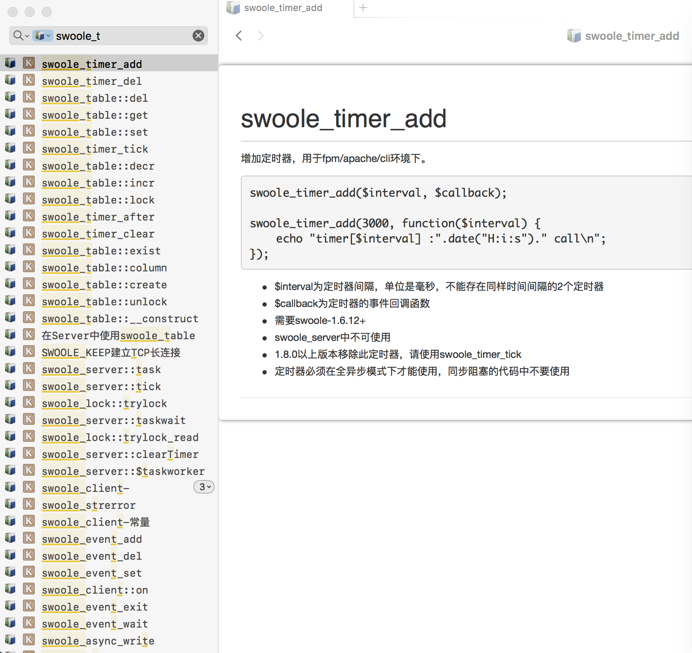

# swoole-chinese-docset

Swoole Chinese Docset for Dash

[generation method](./src/README.md)

[Swooke Wiki](http://wiki.swoole.com/)

## CHANGELOG
- Added `swoole 4 is supported` [20240901]

[Kapeli/Dash-User-Contributions](https://github.com/Kapeli/Dash-User-Contributions/tree/master/docsets/Swoole_Chinese)
